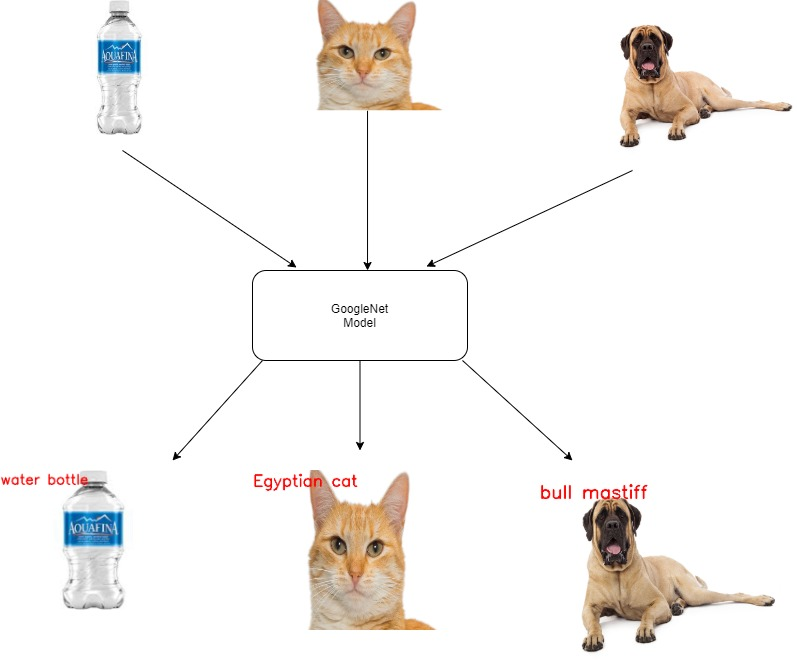

# Object-Classification-using-GoogleNet-Model
# test3



## Definition

This project is object classification using GoogleNet pre-trained model.


## Description

The code begins by resizing the images to size that fit the model(GoogleNet) then the image is pre-processed and then the model classifies the image. if the probability of classification exceeds a certain threshold then the results of the model will be reported otherwise the model failed to classify the image.

### Dependencies

#### install this libraries:
- numpy
- OpenCV


#### Download any image you want to classify and put it in Photos directory and change this line according to the name of your image then run the code.

```html
frame = cv2.imread("photos\dog.JPG")
```
This project based on OpenCV tutorial found in this [link](https://docs.opencv.org/master/d5/de7/tutorial_dnn_googlenet.html)
